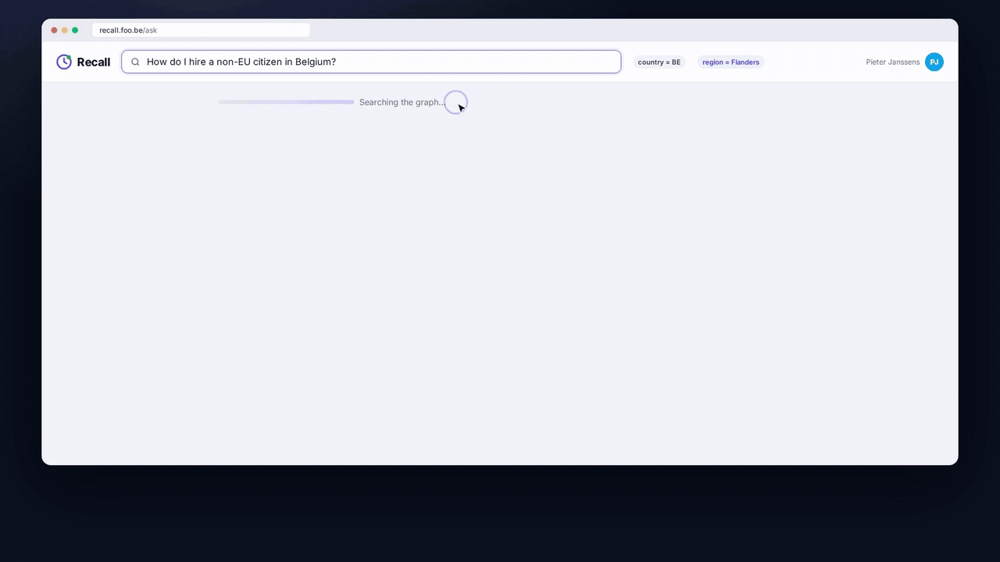

# Recall

**Find it. Understand it. Trust it.** Organisational knowledge that stays current, owned and sourced.
*Built on **TOKG**, a Temporal Ownership-Grounded Knowledge Graph.*



**▶ [Watch the full demo (2:57)](video/recall_demo.mp4)**

Companies now produce more text than anyone can read: emails, meeting summaries, wikis and policy documents, and more and more of it is AI-generated. Search and AI assistants can find all of it. What they can't tell you is which version is current, whether it applies to your case, or whose word counts. The information exists, but people can't act on it with confidence.

Recall ingests those scattered sources and turns them into a knowledge graph of facts. Each fact records when it is valid, who owns it, and the exact quote it came from. When a new source contradicts an old one, TOKG either supersedes the old fact while keeping its history, or escalates the change to the owner for approval. So a question gets one answer that applies to *your* context, with the evidence behind it and the person to ask when the documents run out.

## What it does

- **Temporal**: newer facts supersede older ones, and the history is kept.
- **Ownership**: every fact has an owner, and changes from anyone else wait for their approval.
- **Grounding**: every fact links to its source and the exact quote.
- **Human in the loop**: open questions go to the owner, and their answers flow back into the graph.
- **Automated extraction**: an LLM extracts facts, guided by a YAML domain schema.
- **Denoising**: duplicates merge, and stale or out-of-context facts stay out of the answer.

## Example

> *"How do I hire a non-EU citizen in Belgium?"* (a hiring manager at Foo BV)

The process is spread across a 2023 wiki page, a 2025 meeting summary that changed it, a stale wiki copy, and the email threads of two past hires. Recall answers:

- **Current:** apply through the online platform, and only Sophie Claes submits (about 2.5–3 months). This supersedes the 2023 wiki process.
- **Precedent:** Ravi Kumar (India) and Camila Souza (Brazil, 11 weeks), each linked to their emails.
- **Ask:** Sophie Claes, the process owner.

Two more scenarios, sick leave and hardware purchases, are described in [`examples/data/README.md`](examples/data/README.md).

## Setup

Requires [uv](https://docs.astral.sh/uv/) and Python 3.13+. For live LLM mode you also need the [Claude Code](https://claude.com/claude-code) CLI, logged in. No API key is needed. The mock SD Worx Portal needs Node 20+.

```bash
git clone https://github.com/YusufHosny/tokg && cd tokg
uv sync --all-extras
uv run pytest                # the test suite needs no LLM
```

## Usage

The Foo config is in `examples/foo/`:
- `schema.yaml` defines the domain.
- `seed.yaml` is the human bootstrap: people from `examples/data/people.json`, canonical topics, initial owners and authorities.
- `rig.yaml` is a recorded run for deterministic replay.

**Build the graph and ask.** `--rig` replays the recorded extraction, decisions and answers, so no LLM is needed:

```bash
FLAGS="-s examples/foo/schema.yaml --seed examples/foo/seed.yaml --store foo.snapshot.json --rig examples/foo/rig.yaml"
uv run tokg ingest examples/data $FLAGS
uv run tokg ask "How do I hire a non-EU citizen in Belgium?" $FLAGS -c country=BE
```

**Live mode.**
- Drop `--rig` to extract and answer with Claude Code. Set `TOKG_MODEL` to change the model (default `sonnet`).
- Add `--llm-resolve` to let the LLM resolve updates too.
- `--record PATH` runs live and writes everything into a new rig file for replay. It can't be combined with `--rig`.

**Web app + HTTP API.** `tokg serve` runs the API and the Recall web app at http://127.0.0.1:8000/app/. Sign in with a token: paste it in, or open `/app/#token=<token>`.

```bash
uv run tokg token person:sophie-claes-foo-be --tokens tokens.yaml --role admin   # prints a token once
uv run tokg serve $FLAGS --tokens tokens.yaml --cors http://localhost:5173
```

In the app you can ask a question and see the current answer, how it changed over time, and previous cases with their sources. "Ask <owner>" raises a question for that person, and owners get an inbox for approving changes and answering questions. Other systems, such as SD Worx's own portal, can call the same API:

```bash
curl -H "Authorization: Bearer $TOKEN" -H "Content-Type: application/json" \
  -d '{"question": "How do I hire a non-EU citizen in Belgium?", "context": {"country": "BE"}}' localhost:8000/ask
```

**MCP**: query Recall from your own agent (e.g. Claude Code):

```bash
claude mcp add recall -- uv run --directory "$PWD" tokg mcp $FLAGS --user person:pieter-janssens-foo-be
```

**Mock SD Worx Portal**: the portal SD Worx gives Foo's employees. New tickets are written to `examples/data/portal/` and become a new source for Recall:

```bash
cd examples/sdworx-portal && npm install && npm run dev    # http://localhost:5173
```

**As a library:**

```python
from tokg import KnowledgeGraph, Schema, load_sources
from tokg.seed import Seed

graph = KnowledgeGraph(Schema.from_yaml("examples/foo/schema.yaml"),  # in-memory store, Claude Code extraction
                       seed=Seed.from_yaml("examples/foo/seed.yaml"))  # bootstraps people, topics, owners
graph.ingest(load_sources("examples/data"), workers=8)                   # parallel extraction, chronological resolution
result = graph.ask("How do I hire a non-EU citizen in Belgium?", {"country": "BE"})
result.answer, result.views[0].owner, result.views[0].contacts   # the answer, who owns it, who to ask
```

More detail: [`docs/technical.md`](docs/technical.md) (how TOKG works, the data model and the stack) · [`docs/business.md`](docs/business.md) (market, model and roadmap).

**Unfinished:** the Neo4j store is included but untested; the in-memory store with JSON snapshots is the supported backend. The web app is a single static page and has no SSO yet.

## Team

Made by team **AlladinsAgents** (Yusuf Hussein, Karam Kokash, Ahmed Salheen and Alex Gretski, *alpha leader*) at the **Tectonic 2026 hackathon in Leuven**, for the SD Worx challenge *"Unlock the Knowledge Within"*.
